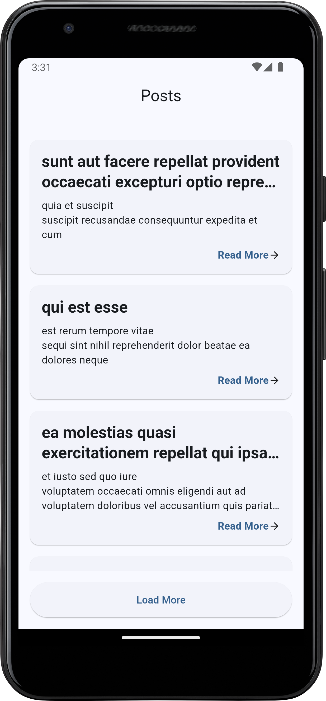
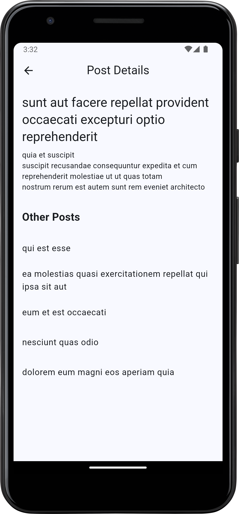

# PostHub - Flutter Social Posts App

A Flutter application that fetches and displays posts from JSONPlaceholder API with offline support, pagination, and a clean architecture approach.

<p float="left">
  
  
</p>
## Getting Started

- Flutter SDK (3.0.0 or higher)
- Dart SDK (3.0.0 or higher)
- Android Studio / VS Code with Flutter plugins

### Installation

1. Clone the repository:

   ```bash
   git clone https://github.com/yourusername/post_hub.git
   cd post_hub
   
2. Install dependencies:

   ```bash
   flutter pub get
   
3. Generate Hive adapters:

   ```bash
   flutter pub run build_runner build
   
4. Run the app:

   ```bash
   flutter run
   

## Features

- **Clean Architecture**: Domain-driven design with clear separation of concerns
- **Offline Support**: View posts even without an internet connection
- **Pagination**: Load posts in batches with "Load More" functionality
- **Pull-to-Refresh**: Swipe down to refresh posts
- **Smooth Animations**: Hero animations between list and detail views
- **Error Handling**: Graceful handling of network and server errors
- **Material Design**: Clean and modern UI with Material 3 components

## Tech Stack

- **State Management**: Flutter BLoC
- **Networking**: Dio
- **Local Storage**: Hive
- **Dependency Injection**: GetIt
- **Functional Programming**: Dartz for Either type
- **UI Components**: Material Design 3
- **Loading Animations**: Shimmer effect for loading states